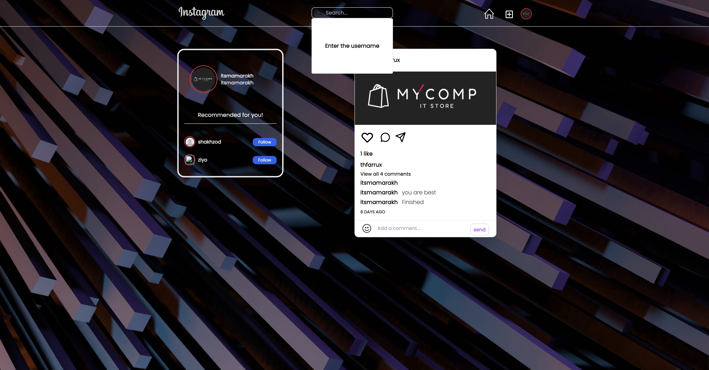
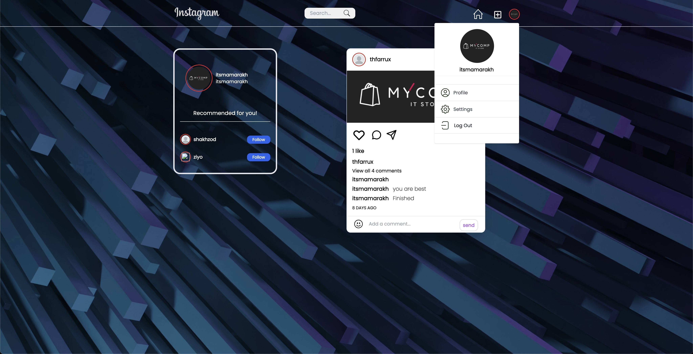
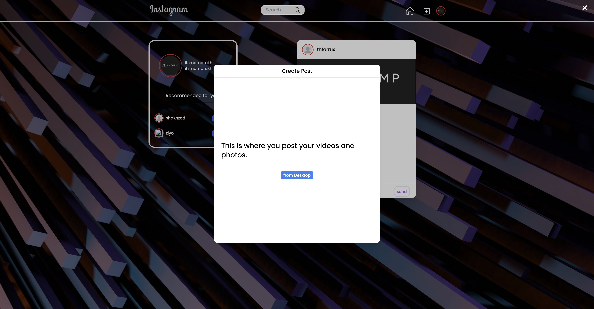
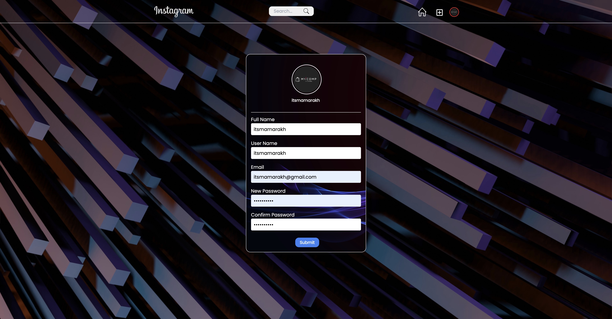
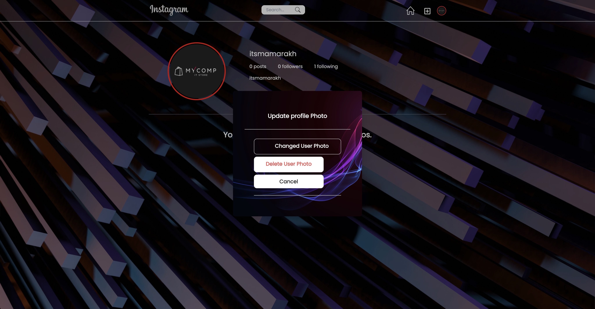

          ███╗░░░███╗██╗░░░██╗░░░░░░██╗███╗░░██╗░██████╗████████╗░█████╗░░██████╗░██████╗░░█████╗░███╗░░░███╗
          ████╗░████║╚██╗░██╔╝░░░░░░██║████╗░██║██╔════╝╚══██╔══╝██╔══██╗██╔════╝░██╔══██╗██╔══██╗████╗░████║
          ██╔████╔██║░╚████╔╝░█████╗██║██╔██╗██║╚█████╗░░░░██║░░░███████║██║░░██╗░██████╔╝███████║██╔████╔██║
          ██║╚██╔╝██║░░╚██╔╝░░╚════╝██║██║╚████║░╚═══██╗░░░██║░░░██╔══██║██║░░╚██╗██╔══██╗██╔══██║██║╚██╔╝██║
          ██║░╚═╝░██║░░░██║░░░░░░░░░██║██║░╚███║██████╔╝░░░██║░░░██║░░██║╚██████╔╝██║░░██║██║░░██║██║░╚═╝░██║
          ╚═╝░░░░░╚═╝░░░╚═╝░░░░░░░░░╚═╝╚═╝░░╚══╝╚═════╝░░░░╚═╝░░░╚═╝░░╚═╝░╚═════╝░╚═╝░░╚═╝╚═╝░░╚═╝╚═╝░░░░░╚═╝

<h1>Instagram_clone_master</h1>
<a href="https://instagram-clone-master-app.netlify.app" alt="">Instagram
  

  <h1> GitHub Link</h1>
<a href="https://github.com/itsmamarkh/instagram_clone_master" alt="">GitHub

